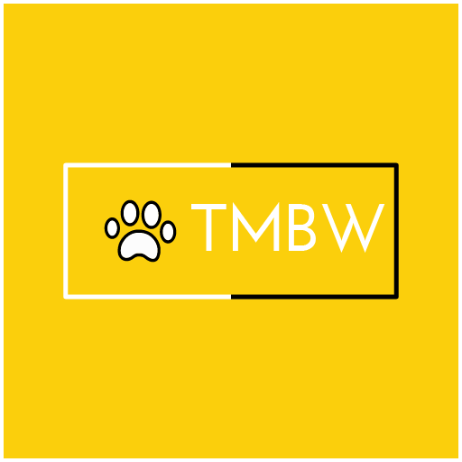

  <!-- ⚠️ This README has been generated from the file(s) "blueprint.md" ⚠️-->
  <p align="center">
  
  </p>
  </div>

  <h1 align="center">TMBW API</h1>

  <p align="center">
    
    

  

  

  </p>

  <!-- Status -->

  <!-- <h4 align="center"> 
    🚧  Rest Api Nodejs Mongodb 🚀 Under construction...  🚧
  </h4> 

  <hr> -->

  <p align="center">
    <a href="#dart-about">About</a> &#xa0; | &#xa0; 
    <a href="#sparkles-features">Features</a> &#xa0; | &#xa0;
    <a href="#rocket-technologies">Technologies</a> &#xa0; | &#xa0;
    <a href="#white_check_mark-requirements">Requirements</a> &#xa0; | &#xa0;
    <a href="#checkered_flag-starting">Starting</a> &#xa0; | &#xa0;
    <a href="#memo-license">License</a> &#xa0; | &#xa0;
    <a href="https://github.com/khaledosama007" target="_blank">Author</a>
  </p>

  <br>


  [](#dart-about-)

  ## ➤ :dart: About ##

  API for TMBW mobile app, built using Node.js, MongoDB and Express server, and hosted on Digital Ocean Servers


  [](#sparkles-features-)

  ## ➤ :sparkles: Features ##

  :heavy_check_mark: Create account\
  :heavy_check_mark: Add Pet\
  :heavy_check_mark: Add AD \
  :heavy_check_mark: Show all current Ads\
  :heavy_check_mark: Filter Ads\
  :heavy_check_mark: Contact Ad owner


  [](#rocket-technologies-)

  ## ➤ :rocket: Technologies ##

  The following tools were used in this project:

  - [Expo](https://expo.io/)
  - [Node.js](https://nodejs.org/en/)
  - [React](https://pt-br.reactjs.org/)
  - [React Native](https://reactnative.dev/)
  - [TypeScript](https://www.typescriptlang.org/)


  [](#white_check_mark-requirements-)

  ## ➤ :white_check_mark: Requirements ##

  Before starting :checkered_flag:, you need to have [Git](https://git-scm.com) and [Node](https://nodejs.org/en/) installed.


  [](#checkered_flag-starting-)

  ## ➤ :checkered_flag: Starting ##

  ```bash
  # ➤ Clone this project
  $ git clone https://github.com/khaledosama007/tmbw-backend

  # ➤ Access
  $ cd tmbw-backend

  # ➤ Install dependencies
  $ npm install

  # ➤ Run the project
  $ npm start

  # ➤ The server will initialize in the <http://localhost:3000>
  ```


  [](#memo-license-)

  ## ➤ :memo: License ##

  This project is under license from MIT. For more details, see the [LICENSE](LICENSE.md) file.


  Made with :heart: by <a href="https://github.com/khaledosama007" target="_blank">Khaled Osama</a>

  &#xa0;

  <a href="#top">Back to top</a>
